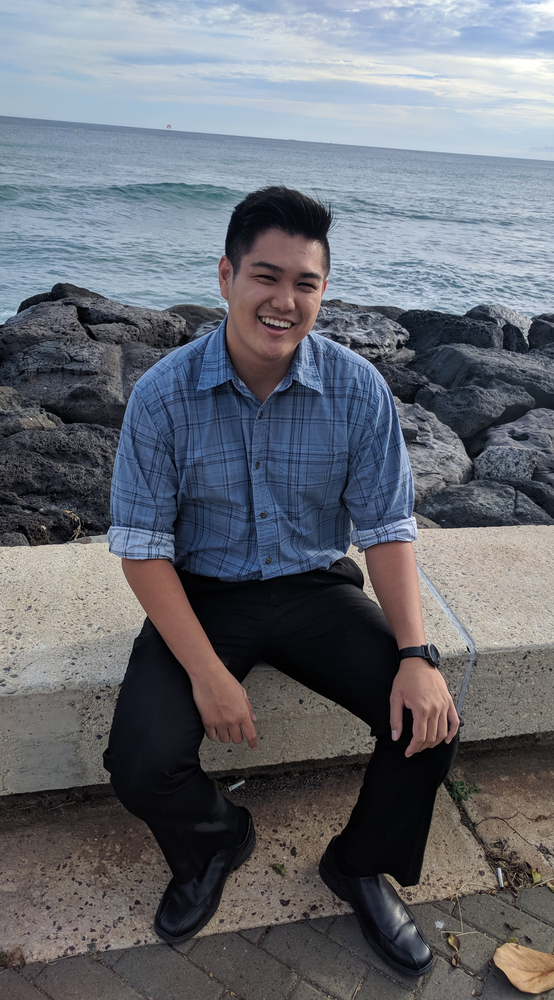

<h3 class="ui header">Interests</h3>

<ul>
  <li>Embedded Systems</li>
  <li>Internet of Things</li>
  <li>Web Development</li>
  <li>UI Design</li>
  <li>Software Engineering</li>
  <li>Artificial Intellegence</li>
  <li>Firmware Development</li>
  <li>Cyber Security</li>
</ul>

I was always an engineer at heart and had been lucky enough to drop into the doorstep of the thing that I had been trying to find ever since I was young. From an early age, I was definitely interested in building things. I’ve always been fascinated by intricate parts to blinking lights on electronics and now, I aspire to bring these imaginations into reality. This interest never left me, only growing more profound and passionate with every new discovery I made. Building, anything, had this lure to them that further fueled my curiosity. 

Naturally, with my interest in computers and with my desire to create, my career choice gravitated towards Computer Engineering. Although it didn't happen immediately, I eventually got the sense that this was what I was looking for. When I come to think if it, technology has changed so fast over the years, and through my childhood experiences, I now strive to become a part of it. So here I am now, an electronics hobbyist, an aspiring software developer and still a builder of things. 

