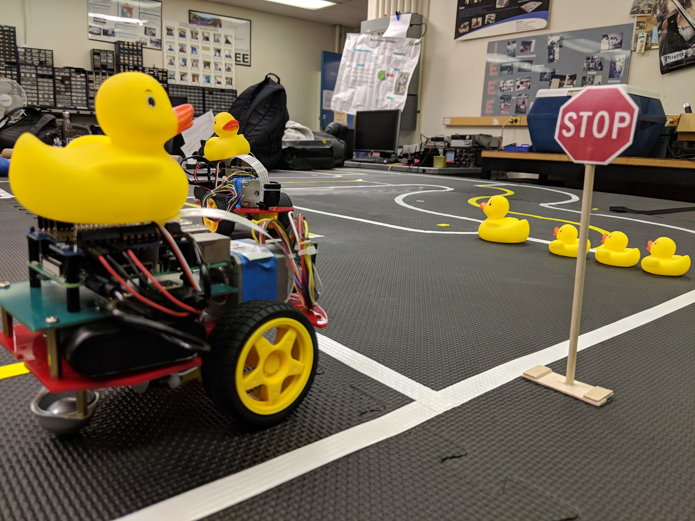
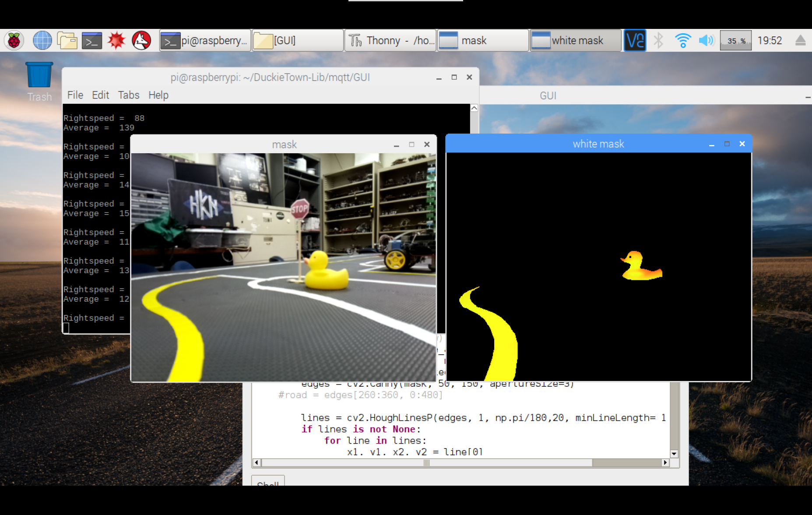

### Project Overview
 Autonomous vehicles operate without human intervention and introduces a method for increasing efficiency and improving road safety. The Duckietown project is an educational platform built for learning about autonomous systems. Robot ducks utilize computer vision techniques to sense their local environment and classify different types of traffic signals to generate navigation paths whilst obeying transportation rules. RaspberryPis are used as the processing unit for the ducks in our interpretation of Duckietown.

The DuckieTown platform is geared to: 

<ul>
<li>Provide a platform for research on traffic</li>
<li>Utilize vision processing algorithms and machine learning</li>
<li>Display viable methods of mesh communication within a community</li>
</ul>
### Learning Outcomes
  The duckietown project utilizes an onboard camera to retrieve information of the surrounding area.  Feature detection methods recognize pixel patterns to classify objects in computer vision. To classify objects the software needs to extract defining features such as shapes, color patterns, straight lines, or corners. For this project, I serve as a firmware/software developer for the image processing component of the robot. We are in the process of utilizing local binary patterns to train a support vector machine to identify objects. The robot will be trained to recognize stop signs, traffic lights, and other obstacles/features in order to autonomously navigate a town while obeying traffic laws. 

You can learn more at the [UH Micromouse Website](http://www-ee.eng.hawaii.edu/~mmouse/about.html).
