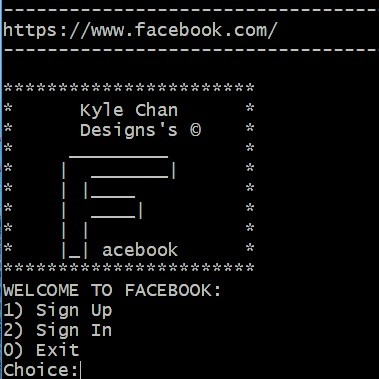

Implemented a simple version of a Facebook social application structure. Using object-oriented programming (C++) we created an application where users can sign up for the program which generates a profile that holds information specific to each user. Users are able to find friends using the built-in search function and request to add them to their friends list. Once confirmed as friends, users are able to view each other's mutual friends & friends lists to connect with more people. Users are able to communicate with each other by using the wall post function which will create a public thread for friends to chat.  User's private information is protected through a password login which can be reset as requested. 

For this project, I was in charge of the friends list feature where we generate a list of users as they are created. I implemented a search function that will fetch a profile based off of first and last names & usernames. This application also uses a filtering mechanism which will compare individual friends lists and create a mutual friends option. I also worked on implementing the interface where users can sign up and sign into the application. Overall this project gave me a good look into object oriented programming in C++.

