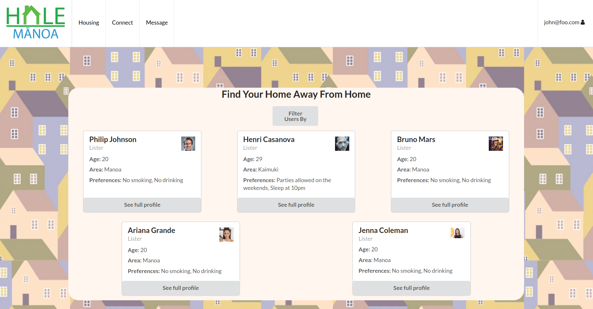
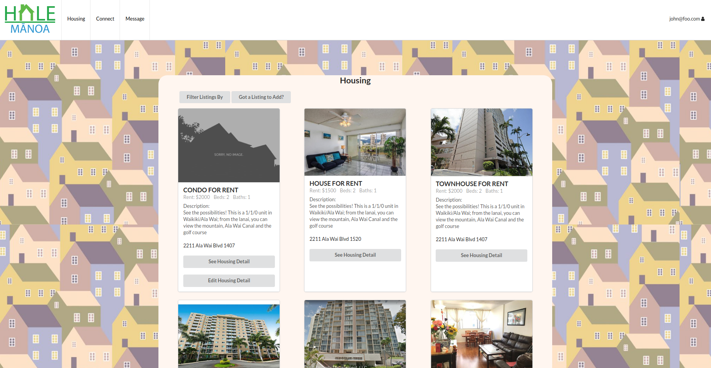

### Project Overview
Working in a team of four at University of Hawaii, we built a web application, Hale Manoa.The motivation to the Hale Manoa web application is such that many students at UH Manoa are looking for a place to live off campus and would like to live with other compatible students. Hale Manoa offers users the ability to connect with others who are seeking off campus housing. 

The application allows users to: 

<ul>
<li>Create personalized profiles to showcase user information and other user preferences</li>
<li>Post housing availability</li>
<li>Connect and direct message other users</li>
<li>Search for housings and people</li>
<li>Filter search results to accommodate user preferences</li>
</ul>

Below is a screen capture of the project user listing page that showcases users seeking a roommate: 

Below is a screen capture of the project housing listing page that showcases available housing in the manoa area: 

### Meteor Application Development
The application was built using the ReactJS & Meteor. I was responsible for the layout of the homepage and the integration of the message board. To build the application, our team utilized HTML, React.JS, React Semantic UI, JavaScript, and CSS. For production our team used Git and GitHub for version control to improve code quality and resolve issues. I designed the home page and implemented the searching mechanism that allowed users to search the database for users and housing listings. I also implemented our project's messaging system to allow users to direct message other users.
### Learning Outcomes
This project allowed me to gain experience and skills in website development. Through this project I became familiar with the Meteor Framework, HTML, CSS, and React.JS. By working in a team, I was able to improve my project management skills through issue tracking and Git/Github. Overall development skills were obtained in order to create smaller flexible modules to construct the overall application. 

[Click here](https://hale-manoa.github.io/) to see the Hale Manoa project page. 

Source: <a href="https://github.com/hale-manoa/hale-manoa" target="_blank"><i class="large github icon"></i>https://github.com/hale-manoa/hale-manoa</a>

