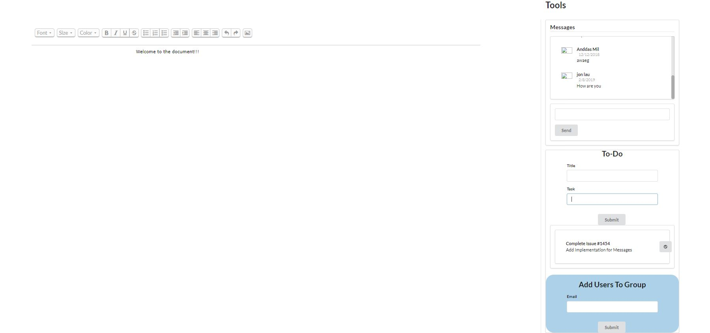
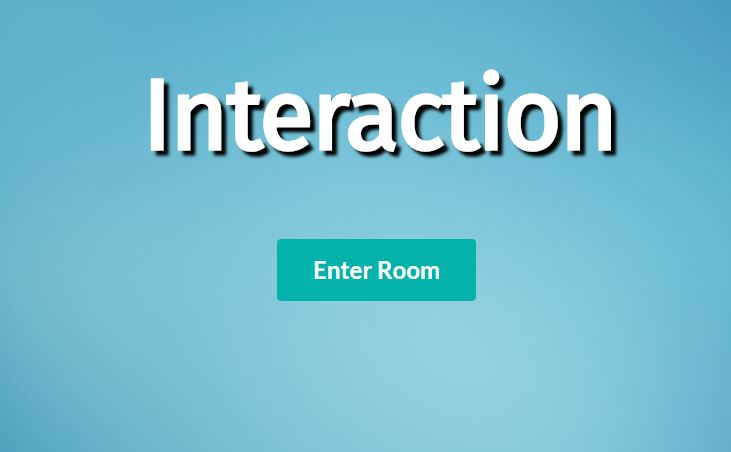

### Project Overview
Implemented a simple web application to allow users to sign up for accounts and collaborate on a single document. Users are able to create private documents and invite other users to collaborate by adding them to groups. Once in a group, users are able to communicate with others in the group using the real-time in-browser chat that was built using custom components and MongoDB. This application features a simple task management logger where users can create to-do items and dismiss them upon completion. Reactive compnents were used to autopopulate default accounts & information on the document. For this project, I was in charge of the chat interface. I implemented the storage users and management of groups using MongoDB. Utilizing ReactJS and Semantic UI, we created a simple interface that allows for ease of access while using the app. 

The application allows users to: 

<ul>
<li>Create profiles to store personal information and save documents privately on our database</li>
<li>Create and collaborate on a document with other users</li>
<li>Communicate with other users through a real-time chatroom</li>
<li>Create/dismiss a to-do list during projects</li>
</ul>

