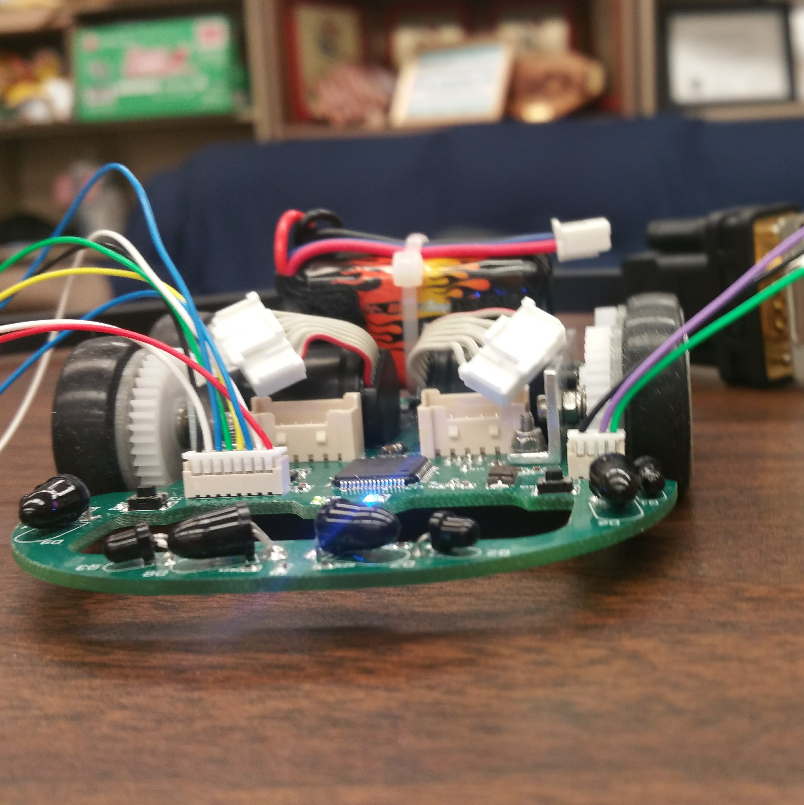

### Project Overview
Micromouse is a competition which tasks teams to design and program an autonomous (mouse) robot to find the fastest path to the center of a 16 by 16 cell maze. The objective of this project is to produce a micromouse which can perform at a high level of competition.

The micromouse that we built features: 

<ul>
<li>Infrared emitters and detectors to drive within the maze without collisions</li>
<li>Internal system that can accurately determine the position of the mouse within the maze using encoders</li>
</ul>

### Learning Outcomes
For this project, I served as a firmware/software developer for the robot. After the mouse was physically built, we first tested each infrared sensor to ensure accurate and reliable data readings as these sensors would serve as our main decision-making parameters.  From there, I then programmed the basic PD controls for the motors of the mouse.  The PD control will control our velocity ensuring that we are driving the motors at the right speed. We also used the PD control to control our position within the maze to ensure that the mouse is centered in each cell. Using motor encoder ticks, we were able to track the approximate distance traveled over time to make precise movements. I also programmed basic algorithms used to solve the maze such as a right wall hugger and a left wall hugger algorithm. We finished with the fastest mouse in the University of Hawaii Fall 2017 competition.

You can learn more at the [UH Micromouse Website](http://www-ee.eng.hawaii.edu/~mmouse/about.html).
