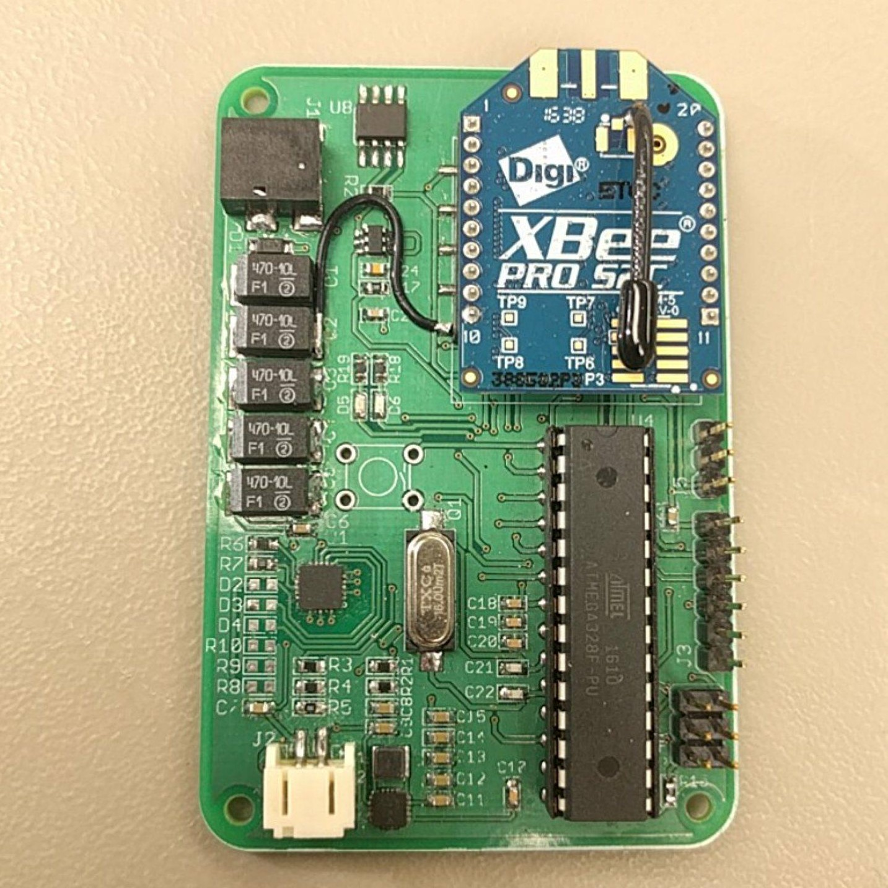

Weatherboxes create a network that will allow us to recognize weather patterns to help us anticipate certain changes. Each new weatherbox will provide further insight on the weather in hopes for better understanding of PV. Data that is collected  will be used to study and analyze the behavior of this renewable energy source, specifically solar irradiance patterns throughout the day, month, and year. By doing this we can help to plan and design future buildings to optimize our collection of renewable energy at the University of Hawaii.

Temperature, pressure, humidity, and solar irradiance readings are taken and stored into a packet that will be transmitted via XBee. To create these packets the firmware will initialize a payload and takes our sensor readings and stores the data according to the specific data type. The packet is then transmitted and stored within our lab. Finally, the packet is cleared and the process will loop every desired interval of time. 

Through the Weatherbox, we have gained an invaluable amount of technical knowledge about the hardware and software skills aspects of a project. More specifically, we were exposed to creating PCBs using EAGLE, soldering both surface mount and through-hole electronic components, 3D modeling using SketchUp, and programming the sensors using the Arduino platform.  In addition to the technical skills, this project also gave us the opportunity to refine our soft skills.  We learned to ask for help when needed, how to communicate effectively, and to manage our time in order to meet project deadlines. Furthermore, this project served as a learning tool for real-world applications of the engineering process. We learned to analyze the cost-benefits of our design choices and to make iterative improvements for future revisions.

You can learn more at the [SCEL Website](http://scel-hawaii.org/).